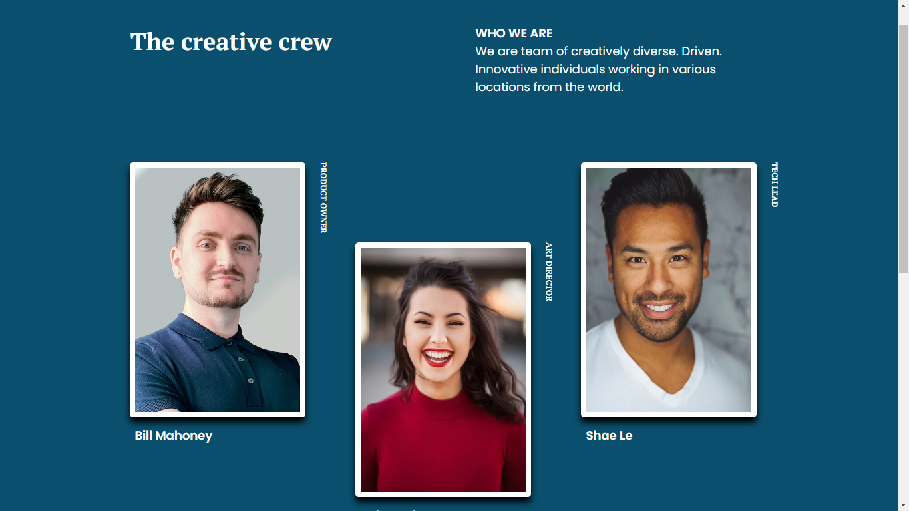

# DevChallenges My Team Page - Solución

Esta es mi solución para el desafío [My Team Page](https://devchallenges.io/challenges/hhmesazsqgKXrTkYkt0U) en DevChallenges. DevChallenges es una plataforma que te permite mejorar tus habilidades de codificación mediante la construcción de proyectos del mundo real.

## Descripción General
### Captura de Pantalla de mi Solución

Estoy compartiendo mi solución para el proyecto "My Team Page" de DevChallenges. El objetivo de este proyecto era crear una página que mostrara información sobre el equipo de una empresa, siguiendo el diseño proporcionado.

## Desafíos

Uno de los desafíos más importantes que enfrenté fue el posicionamiento de la descripción del perfil profesional. Inicialmente, intenté utilizar propiedades como la rotación y la posición absoluta para lograr el diseño deseado, pero resultó ser complicado y poco efectivo.

Finalmente, di con la solución al usar la propiedad `writing-mode: vertical-rl;`. Esta propiedad me permitió rotar el texto en el eje vertical de manera más efectiva y lograr el diseño deseado para la descripción del perfil profesional.

## Enlaces

- [Solución en GitHub](https://github.com/CristianAguilar-dev/My-team-pageDevChallenges)
- [Ver sitio en vivo](https://cristianaguilar-dev.github.io/My-team-pageDevChallenges/)

## Herramientas Utilizadas

- [HTML Semántico](https://developer.mozilla.org/es/docs/Learn/HTML/Introduction_to_HTML/Document_and_website_structure)
- [CSS Personalizado](https://developer.mozilla.org/es/docs/Web/CSS)
- [Google Fonts](https://fonts.google.com/)
- [CSS Grid](https://developer.mozilla.org/en-US/docs/Web/CSS/CSS_Grid_Layout)
- [Diseño Responsivo](https://www.w3schools.com/html/html_responsive.asp)

## Desarrollo Paso a Paso

Evaluación del Desafío: Comencé revisando los detalles del desafío en DevChallenges para comprender los requisitos y el diseño proporcionado.

Estructura HTML: Empecé creando la estructura básica de la página utilizando etiquetas HTML semánticas como `<section>`, `<figure>`, `<article>`, etc. Esto ayudó a organizar el contenido de manera significativa.

Estilos CSS: Luego me enfoqué en aplicar estilos al proyecto. Utilicé estilos personalizados de CSS para establecer colores, tamaños y espaciados coherentes en todo el diseño.

Diseño Responsivo: Siguiendo el enfoque "mobile-first", me aseguré de que la página fuera responsive y se adaptara a diferentes tamaños de pantalla utilizando consultas de medios y ajustando los estilos según fuera necesario.

### Desafío del Diseño Responsivo

Una de las dificultades que encontré durante el desarrollo fue hacer que el diseño fuera responsive, especialmente cuando se comienza con estilos generales para pantallas de escritorio. La adaptación para dispositivos móviles requirió ajustes cuidadosos y consultas de medios adicionales para garantizar que la página se viera y funcionara bien en tamaños de pantalla más pequeños.

### Construido con

- HTML Semántico
- CSS Personalizado
- Enfoque "Mobile-First"
- [Google Fonts](https://fonts.google.com/)
- [CSS Grid](https://developer.mozilla.org/en-US/docs/Web/CSS/CSS_Grid_Layout)
- [Diseño Responsivo](https://www.w3schools.com/html/html_responsive.asp)

## Lo que Aprendí

Durante este proyecto, aprendí cómo estructurar y diseñar una página web siguiendo un diseño proporcionado. También adquirí experiencia en la implementación de estilos y la adaptación de diseños para dispositivos móviles.

## Desarrollo Continuo

Continuaré enfocándome en mejorar mis habilidades de diseño y desarrollo web, así como en aprender más sobre la creación de páginas web interactivas.

## Reflexión

Este desafío me ha permitido practicar y aplicar mis conocimientos en un proyecto real. Cada proyecto es una oportunidad de aprendizaje y un paso hacia la mejora de mis habilidades de desarrollo web.

## Autor

- [Perfil en DevChallenges](https://devchallenges.io/portfolio/CristianAguilar-dev)

## Agradecimientos

Agradezco a DevChallenges por proporcionar desafíos interesantes y a la comunidad por brindar apoyo y retroalimentación constructiva.
